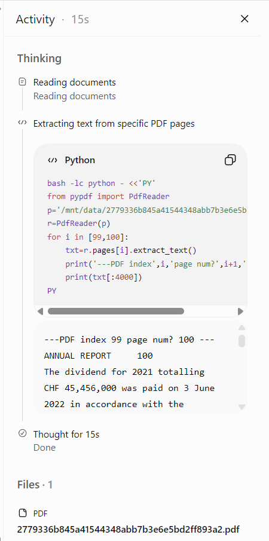

## Middleware 

如果你看过之前 LangChain 本身的 Middleware 的一些东西，其实就能理解。

首先，Middleware 在这里就不再赘述是什么了，你就可以把它理解为类似于 Java 的 AOP 操作：
1. 针对模型、工具、Agent 的前后以及整个生命周期进行一些操作
2. 创建了一个 Hook
3. 顺序执行


## Backends

属于 LangChain 的 DeepAgents 在实践中的一个扩充体系。它主要为 Medwell 提供了一些执行任务的空间。

如果你看过 Grok 或者  ChatGPT，可以发现他们在 Chatbot 当中，当你上传一些很大的文件（比如几十页、超过 50 页的大体积 PDF），并针对这个文件进行询问时，它对于文件的处理和来源是在一个不同的地方进行的。我随便截了一张图



在这里你就可以看到，它文件的地址明显是在一个沙盒性质的东西里。首先它是 /mnt，所以它一定是在一个沙盒里面。在各种 AI chatbot 的实践中，你可以明显感受到文件这类东西的处理。目的是一些隔离，我认为。
所以说对于开发来说，我也默认用了这种方式，

Backends 实现了以下几个 backends

``` python
__all__ = [
    "DEFAULT_EXECUTE_TIMEOUT",
    "BackendContext",
    "BackendProtocol",
    "CompositeBackend",
    "ContextHubBackend",
    "FilesystemBackend",
    "LangSmithSandbox",
    "LocalShellBackend",
    "NamespaceFactory",
    "StateBackend",
    "StoreBackend",
]
```

然后在 backend context 和 backend protocol 里面集成了，因为我之前说了，它是属于给 Agent 提供一个执行任务的空间，所以它规定了一些基本的操作，比如说 ls、read、update 这些内容。


### Backends.CompositeBackends

> 其实这就是个路由器，根据 `prefix` 把任务导入到正确的 `backends`


