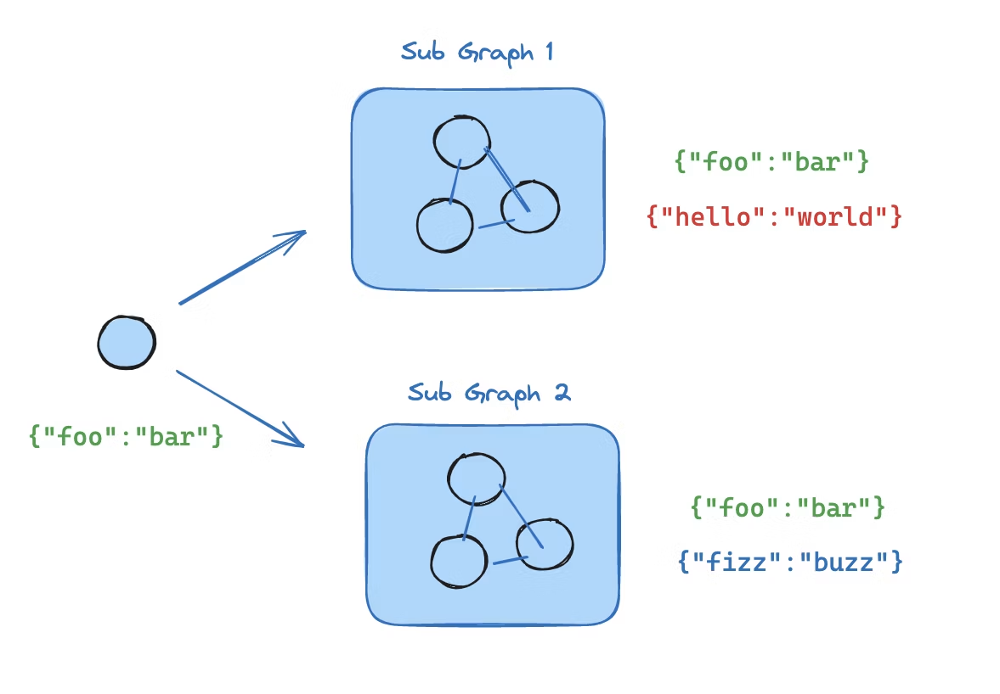
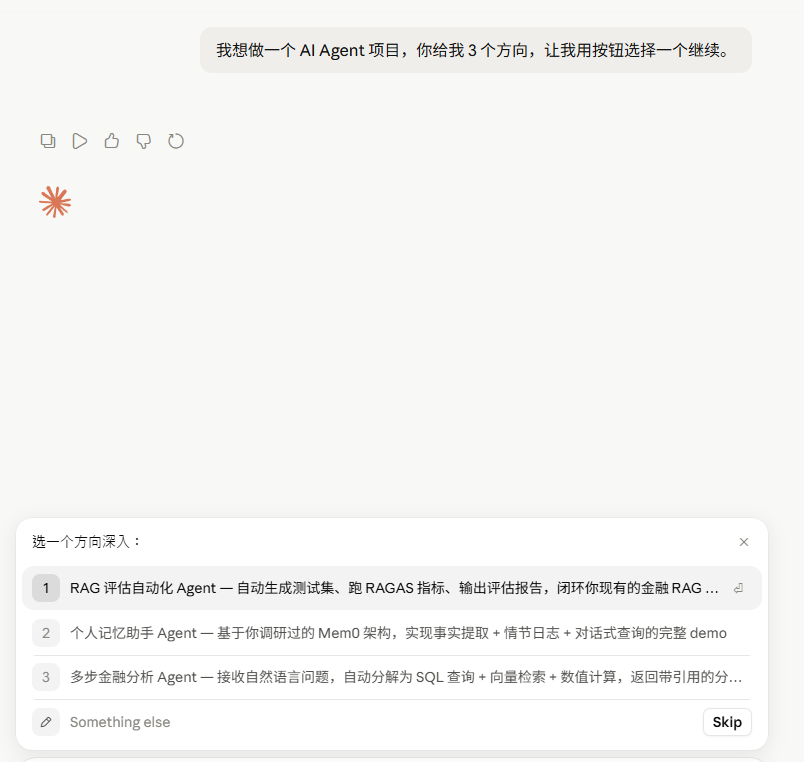

# LangChain Agent Factory 与 Middleware

> [!NOTE]
> 从 2025 年 10 月开始，LangChain 大改后，Agent 创建入口主要挪到了这里。这个方法很重要。

## Factory

agent 创建的工厂方法，有以下参数。特别重要的一点是，从 2025 年大改后，agent 底层走的是 graph 那一套。

要记住底层走 Graph 这一点。它后续的执行，以及整个 Agent 行为的构成，都是依照 LangGraph 的原则去设计的。

| 参数名 | 类型 | 描述 |
| --- | --- | --- |
| model | `str \| BaseChatModel` | 模型本身 |
| tools | `Sequence[BaseTool \| Callable[..., Any] \| dict[str, Any]] \| None` | 初始化时传入的工具 |
| system_prompt | `str \| SystemMessage \| None` | sys 的 prompt |
| middleware | `Sequence[AgentMiddleware[StateT_co, ContextT]]` | 中间件，控制模型的 tool call、agent、model call 前后的行为，是很重要的改动 |
| response_format | `ResponseFormat[ResponseT] \| type[ResponseT] \| dict[str, Any] \| None` | 模型的返回类型 |
| state_schema | `type[AgentState[ResponseT]] \| None` | Agent runtime 的 state 参数 |
| context_schema | `type[ContextT] \| None` | 一些额外的上下文参数 |
| checkpointer | `Checkpointer \| None` | memory，LangChain 管理记忆的核心内容 |
| store | `BaseStore \| None` | LangChain 管理记忆的核心内容 |
| interrupt_before | `list[str] \| None` | HIL 的打断参数，或者一些前后操作可用的，类似 AOP |
| interrupt_after | `list[str] \| None` | 同上 |
| debug | `bool` |  |
| name | `str \| None` | 给 graph 起别名 |
| cache | `BaseCache[Any] \| None` | 给图的执行结果存 cache，类似 lru |

## create_agent 初始化流程

create_agent 初始化的时候经历了这样的流程：

1. 初始化模型。初始化模型的时候用到了 init_chat_model。一般用 LangChain 时，更多情况下是直接把模型塞进去，这也是最简单的初始化方式。
2. 合并消息 input。
3. 合并 System Prompt。初始化带入的时候，它会直接使用 LangChain 专属的 BaseMessage 继承的 SystemMessage 进行转换。
4. 处理 Structured Output。

## init_chat_model

其它的 init_chat_model 方法下又提供了几个参数，主要有两个工程上比较重要：

```python
configurable_fields: Literal["any"] | list[str] | tuple[str, ...] | None = None
config_prefix: str | None = None
```

字面意思就是：可配置/可变的模型变量，以及可配置模型的前缀。

原文是：

```text
configurable_fields: Which model parameters are configurable at runtime.
config_prefix: Useful when you have multiple configurable models in the same application.
```

模型运行时参数的可变，以及给模型上别名，会有很大的可玩空间。比如 A 模型欠费、宕机、不想用了，或者不同任务需要不同价格/类型的模型，就可以通过这种方式切换。

不过 agent 更新之后有了 Middleware，也可以通过 request override 重写当前用的模型，我觉得这个更方便一点。

config_prefix 就更不用说了。有了前缀，不同角色的 Agent 以及不同任务，可以通过前缀使用指定模型去处理。

## structured_output

规定了结构化输出的一堆格式：AutoStrategy、ProviderStrategy、ToolStrategy。

主要是用于 response_format 的输出策略。

AutoStrategy 选择最优的 response strategy，具体会在后续的代码中判断。

ToolStrategy 官方是这样说的：

> For models that don't support native structured output, LangChain uses tool calling to achieve the same result. This works with all models that support tool calling.

对于原生不支持结构化输出的模型，LangChain 会把这部分内容封装成 Tool Calling 的形式，去实现稳定的结构化 Response 效果。

ProviderStrategy 是各大厂商自己的模型原生支持输出结构化结果。

LangChain 本身规定了三种方式：

1. tool strategy
2. auto strategy
3. provider strategy

这三种 strategy 都是针对 response_format 这个参数进行构建的，目的就是迫使模型输出 Structured 的格式。

## Middleware 定义

然后就是 Middleware 的定义。

Middleware 是 LangChain 在 2025 年 10 月大改版以后一个特别重要的特性。它把模型的前后处理、Agent 的执行前后、Tool 的执行前后，以及 Model 周期内可能发生的一些行为进行了封装。它的行为有点像 Java 里的 AOP。

它囊括的几个方法包括：

1. before agent
2. after agent
3. before model
4. after model
5. wrap model call
6. wrap tool call

这几个方法都比较顾名思义，但是具体怎么串联需要看 factory 里的编排逻辑。

之前看文档时，我以为 Middleware 里面的行为是按一个 middleware 一个 middleware 执行的。后来发现它其实更像 Hook：

1. 所有 before 行为：把 Middleware 里面所有的 before 行为通过for循环串到一起，然后顺序执行。
2. 所有 after 行为：同样串到一起，然后执行。
3. wrap 行为：会组合成 wrapper stack，包住对应的 model call 或 tool call。

## wrap tool call 的组合

```python
def _chain_async_tool_call_wrappers(
    wrappers: Sequence[
        Callable[
            [ToolCallRequest, Callable[[ToolCallRequest], Awaitable[ToolMessage | Command[Any]]]],
            Awaitable[ToolMessage | Command[Any]],
        ]
    ],
) -> (
    Callable[
        [ToolCallRequest, Callable[[ToolCallRequest], Awaitable[ToolMessage | Command[Any]]]],
        Awaitable[ToolMessage | Command[Any]],
    ]
    | None
):
    """Compose async wrappers into middleware stack (first = outermost).

    Args:
        wrappers: Async wrappers in middleware order.

    Returns:
        Composed async wrapper, or `None` if empty.
    """
    if not wrappers:
        return None

    if len(wrappers) == 1:
        return wrappers[0]

    def compose_two(
        outer: Callable[
            [ToolCallRequest, Callable[[ToolCallRequest], Awaitable[ToolMessage | Command[Any]]]],
            Awaitable[ToolMessage | Command[Any]],
        ],
        inner: Callable[
            [ToolCallRequest, Callable[[ToolCallRequest], Awaitable[ToolMessage | Command[Any]]]],
            Awaitable[ToolMessage | Command[Any]],
        ],
    ) -> Callable[
        [ToolCallRequest, Callable[[ToolCallRequest], Awaitable[ToolMessage | Command[Any]]]],
        Awaitable[ToolMessage | Command[Any]],
    ]:
        """Compose two async wrappers where outer wraps inner."""

        async def composed(
            request: ToolCallRequest,
            execute: Callable[[ToolCallRequest], Awaitable[ToolMessage | Command[Any]]],
        ) -> ToolMessage | Command[Any]:
            # Create an async callable that invokes inner with the original execute
            async def call_inner(req: ToolCallRequest) -> ToolMessage | Command[Any]:
                return await inner(req, execute)

            # Outer can call call_inner multiple times
            return await outer(request, call_inner)

        return composed

    # Chain all wrappers: first -> second -> ... -> last
    result = wrappers[-1]
    for wrapper in reversed(wrappers[:-1]):
        result = compose_two(wrapper, result)

    return result
```

这里介绍一个比较有特点的方法，就是我之前提过的"倒序执行"。

因为在 Python 中异步方法更常用，所以我这里全程只看异步（Async）的方法。你可以观察一下它 compose 后 Agent 的 wrap_to_call 执行顺序。当你拥有多个中间件（Middleware）时，比如书写顺序是 A Middleware、B Middleware 和 C Middleware，在 for 循环加载时，它们是按顺序读取进去的。

但实际执行时，你需要从最内层进行反向执行。为了实现这一点，它采取了一个比较讨巧的方法，在代码中称之为 `chain_all_wrappers`：

1. 倒序提取：它通过逆序的方式，首先将最后一个 Middleware 拿出来。因为最内层的 wrap_to_call 方法应该是最先被执行的。
2. 链式入参：执行时，B Middleware 的 wrap_to_call 会将 C Middleware 执行的结果作为入参。
3. 迭代融合：它利用 `result = wrappers[-1]` 这种逻辑，将整个序列倒过来进行迭代，并使用 `compose_two` 方法将它们融合在一起。

最终，这个过程会返回一个包含了完整执行顺序的套娃函数体 类似 A(B(C(kwargs)))

具体看这里：

```python
# Chain all wrappers: first -> second -> ... -> last
result = wrappers[-1]
for wrapper in reversed(wrappers[:-1]):
    result = compose_two(wrapper, result)
```

compose two的两个参数都是具体的 awarp_tool_call的

## before/after agent/model 的抽取

```python
# before/after agent/model
middleware_w_before_agent = [
    m
    for m in middleware
    if m.__class__.before_agent is not AgentMiddleware.before_agent
    or m.__class__.abefore_agent is not AgentMiddleware.abefore_agent
]
middleware_w_before_model = [
    m
    for m in middleware
    if m.__class__.before_model is not AgentMiddleware.before_model
    or m.__class__.abefore_model is not AgentMiddleware.abefore_model
]
middleware_w_after_model = [
    m
    for m in middleware
    if m.__class__.after_model is not AgentMiddleware.after_model
    or m.__class__.aafter_model is not AgentMiddleware.aafter_model
]
middleware_w_after_agent = [
    m
    for m in middleware
    if m.__class__.after_agent is not AgentMiddleware.after_agent
    or m.__class__.aafter_agent is not AgentMiddleware.aafter_agent
]
```

ps: 这下子我就想起来了，之前看到的所谓 middleware 执行的顺序问题，是先顺序后倒序出处是那里了，不过有偏差罢了

## wrap model call 的抽取

```python
if middleware_w_awrap_model_call:
    async_handlers = [
        traceable(name=f"{m.name}.awrap_model_call", process_inputs=_scrub_inputs)(
            m.awrap_model_call
        )
        for m in middleware_w_awrap_model_call
    ]
    awrap_model_call_handler = _chain_async_model_call_handlers(async_handlers)
```

model call 和 toolcall由于贯穿他们各自的执行周期，所以也是单独抽取出来的

## state 抽取

和tool一致，从当前的agent 抽取工具后遍历中间件抽取所有的内容

```python
state_schemas: set[type] = {m.state_schema for m in middleware}
# Use provided state_schema if available, otherwise use base AgentState
base_state = state_schema if state_schema is not None else AgentState
state_schemas.add(base_state)
```

resolved_state_schema, input_schema, output_schema = _resolve_schemas(state_schemas)

这里要提一句

···

类似 model_call_limit 中的 thread_model_call这种专属参数，为了避免污染 runtime 内容

for hints in schema_hints.values():
        for field_name, field_type in hints.items():
            should_omit = False

            if omit_flag:
                metadata = _extract_metadata(field_type)
                for meta in metadata:
                    if isinstance(meta, OmitFromSchema) and getattr(meta, omit_flag) is True:
                        should_omit = True
                        break

            if not should_omit:
                all_annotations[field_name] = field_type

    return TypedDict(schema_name, all_annotations)  # type: ignore[operator]

将专属参数标定为 PrivateStateAttr， 同时 PrivateStateAttr 又是 OmitFromSchema 同时通过以上的函数实现了过滤
···

## Graph 初始化

完事以上准备好了以后

```python
graph: StateGraph[
    AgentState[ResponseT], ContextT, _InputAgentState, _OutputAgentState[ResponseT]
] = StateGraph(
    state_schema=resolved_state_schema,
    input_schema=input_schema,
    output_schema=output_schema,
    context_schema=context_schema,
)
```

直接就将所有的状态打包好开始构造初始的图

## Graph 边构造

从 factory.py 的 line 1365~1646 开始，都属于 langgraph 的 edge 构造

把 middleware 的行为（before,after 那一套行为）都挂载成了边

但是每个边是怎么安排的呢？并不是那么随意的，在很久之前，我刚刚接触 langgraph 这一套内容的时候

会存在好几个点，condition_edage, tool_edage 等等，但是复杂 agent loop/harness 的场景，编排会如何？？

整个图如何编排的

其实一般你看官方编排



比较符合惯性的思维

他的 middleware 中，执行顺序是：before_agent -> before_model -> model

行为是这样编排的，遍历出所有的 before/after, agent/model 后，挂上各自的 middleware 下的节点

值得注意的一点是，他设置的 entry/exit node，以及 loop 的 entry/exit

他 entry 的顺序是这样的, 按照一般的 agent 执行逻辑触发

agent 作为 model 的前置行为，会率先作为入口。

## Loop and Tool (循环机制)

对于 langchain 来说，其设计的是基于 loop 的循环

其次是 tool 环节，无论是 harness 或者 agent 的 tool 实现多次循环调用是基操

但是话又说回来，有的工具本身就是结果，不用反复迭代

于是 langchain 在 BaseTool 类规定了 return_direct 参数

True 时直接返回结果后，直接进入 END or after_agent 环节（ after agent 也是 model 执行后的一个环节）

langchain 在设计时提供几套条件路径，

tool 的 edage 走向给出了条件分支 after_agent, model， END， 条件就是以上的内容

loop-exit 则的走向三个节点，分别是：

1. tools
3. exit_node ( after_agent，END )

其中 exit_node 本身也是指向 after_agent，END 这两个环节

LoopX 那个给了一个判断条件，就是 _make_model_to_model_edge 。他这里面搞了好几个逻辑：

1. Jump 逻辑

   如果有指定的 jump_to 目的地，它会直接跳往该目的地，并附带上之前的参数。

2. 消息处理判断

   如果没有 jump 任务，它会再找是否有 AI 消息（AIMessage）和 ToolMessage，判断这两个消息是否已经处理完。

3. 结束节点跳转

   如果没有 AI 消息，则直接跳往结束（END）节点。END 地方包括两个：一个是 END，一个是 after_agent。

4. Pending to Call 状态

   系统会继续判断是否存在 pending_to_call。所谓 pending_to_call，就是工具存在但没有被调用，也没有生成结果。这种情况下，需要再次将工具发送到 tools 节点去执行。

如果已经有了 structured_response（即有明确的结束内容），系统就会直接 END 状态。

我首先会说一下，为什么在 loop 的时候会再次往 tools 上面走。

1. tools 的执行过程可能会报错，你不能保证它百分之百成功。
2. tools 本身可能没有收集到足够的信息。
3. 上层的（比如 Agent As Tool 的 Agent 下属 Tool 在收集到信息后，经由 Agent 判定该信息尚未收集完整，没有完全满足条件。因为信息不够，所以它会再次跳回到 Tool 节点。

这是因为 tools 本身并不只是指某一个具体的工具，同时因为 Agent 也可以作为 tool 存在，所以这是一个比较复杂的情况。

## structured output tool 的分支

以上说的是有 Tool 节点的情况。它后边又分了几个不同的状态：

```python
elif len(structured_output_tools) > 0:
    graph.add_conditional_edges(
        loop_exit_node,
        RunnableCallable(
            _make_model_to_model_edge(
                model_destination=loop_entry_node,
                end_destination=exit_node,
            ),
            trace=False,
        ),
        [loop_entry_node, exit_node],
    )
```

主要这个问题在于，他可能没有给 agent 提供工具，但我又规定了需要一些结构化的输出格式，所以他就这样规定了一下

当 Agent 没有赋给 Agent tool 的时候，他就直接去走 Middleware 的底层流程

## before agent / before model 的边

```python
else:
    _add_middleware_edge(
        graph,
        name=f"{middleware_w_after_model[0].name}.after_model",
        default_destination=exit_node,
        model_destination=loop_entry_node,
        end_destination=exit_node,
        can_jump_to=_get_can_jump_to(middleware_w_after_model[0], "after_model"),
    )

# Add before_agent middleware edges
if middleware_w_before_agent:
    for m1, m2 in itertools.pairwise(middleware_w_before_agent):
        _add_middleware_edge(
            graph,
            name=f"{m1.name}.before_agent",
            default_destination=f"{m2.name}.before_agent",
            model_destination=loop_entry_node,
            end_destination=exit_node,
            can_jump_to=_get_can_jump_to(m1, "before_agent"),
        )
    # Connect last before_agent to loop_entry_node (before_model or model)
    _add_middleware_edge(
        graph,
        name=f"{middleware_w_before_agent[-1].name}.before_agent",
        default_destination=loop_entry_node,
        model_destination=loop_entry_node,
        end_destination=exit_node,
        can_jump_to=_get_can_jump_to(middleware_w_before_agent[-1], "before_agent"),
    )

# Add before_model middleware edges
if middleware_w_before_model:
    for m1, m2 in itertools.pairwise(middleware_w_before_model):
        _add_middleware_edge(
            graph,
            name=f"{m1.name}.before_model",
            default_destination=f"{m2.name}.before_model",
            model_destination=loop_entry_node,
            end_destination=exit_node,
            can_jump_to=_get_can_jump_to(m1, "before_model"),
        )
    # Go directly to model after the last before_model
    _add_middleware_edge(
        graph,
        name=f"{middleware_w_before_model[-1].name}.before_model",
        default_destination="model",
        model_destination=loop_entry_node,
        end_destination=exit_node,
        can_jump_to=_get_can_jump_to(middleware_w_before_model[-1], "before_model"),
    )
```

以上则是，串联 before-agent , before-model的各边

通过 pairwise 的由 A 的组件执行完毕后 导向 B ， 后续依次类推, 构成了 graph 的中间件执行链路

由于操作一致，不在详述

## after model / after agent 的边

```python
# Add after_model middleware edges
if middleware_w_after_model:
    graph.add_edge("model", f"{middleware_w_after_model[-1].name}.after_model")
    for idx in range(len(middleware_w_after_model) - 1, 0, -1):
        m1 = middleware_w_after_model[idx]
        m2 = middleware_w_after_model[idx - 1]
        _add_middleware_edge(
            graph,
            name=f"{m1.name}.after_model",
            default_destination=f"{m2.name}.after_model",
            model_destination=loop_entry_node,
            end_destination=exit_node,
            can_jump_to=_get_can_jump_to(m1, "after_model"),
        )
    # Note: Connection from after_model to after_agent/END is handled above
    # in the conditional edges section

# Add after_agent middleware edges
if middleware_w_after_agent:
    # Chain after_agent middleware (runs once at the very end, before END)
    for idx in range(len(middleware_w_after_agent) - 1, 0, -1):
        m1 = middleware_w_after_agent[idx]
        m2 = middleware_w_after_agent[idx - 1]
        _add_middleware_edge(
            graph,
            name=f"{m1.name}.after_agent",
            default_destination=f"{m2.name}.after_agent",
            model_destination=loop_entry_node,
            end_destination=exit_node,
            can_jump_to=_get_can_jump_to(m1, "after_agent"),
        )

    # Connect the last after_agent to END
    _add_middleware_edge(
        graph,
        name=f"{middleware_w_after_agent[0].name}.after_agent",
        default_destination=END,
        model_destination=loop_entry_node,
        end_destination=exit_node,
        can_jump_to=_get_can_jump_to(middleware_w_after_agent[0], "after_agent"),
    )
```

这里就是之前提过的倒排序执行

前置的执行顺序是 before-agent -> before-model -> model -> after-model -> after-agent -> END (如果没有循环的话)

因为他设计 after系的执行的时候

```python
for idx in range(len(middleware_w_after_model) - 1, 0, -1):
```

逆向进行

## 总结

至此以上，关于 LangChain Create Agent 的 Factory 这个函数重要的地方基本就这些，

以上全部内容都是手打的代码，我会配合 Typeless  口述，并使用 Codex 来整理内容的排版。

---

# Agent Middleware

已经说了 create agent 的构建以后，下面是他 builtin 的 middleware,

| 文件名 | 功能 | 目的 |
| :--- | :--- | :--- |
| **human_in_the_loop.py** | 提供人工审批介入流程，拦截并挂起敏感工具调用，支持人工批准、修改或拒绝。 | 保证敏感/高危操作（如转账、写操作）的安全控制。 |
| **model_call_limit.py** | 监控并限制大模型在单次运行或单个会话中的调用次数。 | 防止 Agent 因规划错误陷入自我纠错的死循环，控制 Token 成本。 |
| **model_retry.py** | 自动重试因限流、超时等网络波动而失败的大模型请求。 | 提高大模型 API 调用的鲁棒性与网络健壮性。 |
| **model_fallback.py** | 当主模型调用持续报错时，按顺序自动降级切换至备用大模型。 | 保证模型层的高可用性和容错能力。 |
| **summarization.py** | 自动在 Token 数量超限时对较早的历史消息进行摘要式压缩并替换。 | 优化上下文窗口占用，控制长会话下的计算与输入 Token 成本。 |
| **pii.py** | 检测并遮蔽（Mask）或哈希（Hash）输入输出中的敏感个人隐私数据。 | 满足安全审计与合规要求，防止用户隐私数据泄漏给外部大模型。 |
| **shell_tool.py** | 绑定持续终端会话工具，并提供 Host、Docker 等执行环境策略。 | 隔离并安全运行大模型生成的代码，避免破坏宿主机。 |
| **tool_call_limit.py** | 监控并限制特定工具或全部工具的累计调用次数。 | 拦截频繁多余的工具调用，避免资源浪费和陷入死循环。 |
| **tool_retry.py** | 对发生瞬时异常的工具调用进行指数退避式自动重试。 | 提高外部 API 工具和三方依赖接口调用的可靠性。 |
| **context_editing.py** | 对超出 token 界限的历史会话进行过滤并将其替换为 placeholder。 | 快速裁切过往冗余的详细工具结果，精简上下文。 |
| **tool_selection.py** | 利用轻量路由模型干预、改写或过滤大模型选择的工具。 | 在模型与工具之间增加一层动态决策路由，控制工具调用流。 |
| **tool_emulator.py** | 使用大模型模拟（仿真）工具的返回结果。 | 供自动化测试和 Dry-run 运行时脱离外部 API 执行评估。 |
| **todo.py** | 提供任务进度待办清单工具，将目标任务分解为 pending、in_progress 和 completed 状态。 | 使模型能保持长序列复杂任务的执行规划和状态可见度。 |
| **file_search.py** | 提供文件系统的 Glob 和 Grep 检索工具。 | 帮助 Agent 能够更加快速精准地定位和读取文件内容。 |

先按下不表，主要是看他的功能设计是怎么做的，在什么节点开始/结束，为什么要放在这个节点开始/结束，能不能放到其他节点开始/结束

针对不同业务该怎么设计自己的？

## types.py (Middleware 的 meta 设计)

(type_define_image - 图片未创建)

这里提供注解是为了方便那些只需要用到单个be/af agent/model周期的行为但是不需要全套的情况

这里直接看一个就行了，逻辑是一样的

```python
def before_agent(
    func: _CallableWithStateAndRuntime[StateT, ContextT] | None = None,
    *,
    state_schema: type[StateT] | None = None,
    tools: list[BaseTool] | None = None,
    can_jump_to: list[JumpTo] | None = None,
    name: str | None = None,
) -> (
    Callable[[_CallableWithStateAndRuntime[StateT, ContextT]], AgentMiddleware[StateT, ContextT]]
    | AgentMiddleware[StateT, ContextT]
):
    """Decorator used to dynamically create a middleware with the `before_agent` hook.

    Args:
        func: The function to be decorated.

            Must accept: `state: StateT, runtime: Runtime[ContextT]` - State and runtime
            context
        state_schema: Optional custom state schema type.

            If not provided, uses the default `AgentState` schema.
        tools: Optional list of additional tools to register with this middleware.
        can_jump_to: Optional list of valid jump destinations for conditional edges.

            Valid values are: `'tools'`, `'model'`, `'end'`
        name: Optional name for the generated middleware class.

            If not provided, uses the decorated function's name.

    Returns:
        Either an `AgentMiddleware` instance (if func is provided directly) or a
            decorator function that can be applied to a function it is wrapping.

    The decorated function should return:

    - `dict[str, Any]` - State updates to merge into the agent state
    - `Command` - A command to control flow (e.g., jump to different node)
    - `None` - No state updates or flow control

    Examples:
        !!! example "Basic usage"

            ```python
            @before_agent
            def log_before_agent(state: AgentState, runtime: Runtime) -> None:
                print(f"Starting agent with {len(state['messages'])} messages")
            ```

        !!! example "With conditional jumping"

            ```python
            @before_agent(can_jump_to=["end"])
            def conditional_before_agent(
                state: AgentState, runtime: Runtime
            ) -> dict[str, Any] | None:
                if some_condition(state):
                    return {"jump_to": "end"}
                return None
            ```

        !!! example "With custom state schema"

            ```python
            @before_agent(state_schema=MyCustomState)
            def custom_before_agent(state: MyCustomState, runtime: Runtime) -> dict[str, Any]:
                return {"custom_field": "initialized_value"}
            ```

        !!! example "Streaming custom events"

            Use `runtime.stream_writer` to emit custom events during agent execution.
            Events are received when streaming with `stream_mode="custom"`.

            ```python
            from langchain.agents import create_agent
            from langchain.agents.middleware import before_agent, AgentState
            from langchain.messages import HumanMessage
            from langgraph.runtime import Runtime


            @before_agent
            async def notify_start(state: AgentState, runtime: Runtime) -> None:
                '''Notify user that agent is starting.'''
                runtime.stream_writer(
                    {
                        "type": "status",
                        "message": "Initializing agent session...",
                    }
                )
                # Perform prerequisite tasks here
                runtime.stream_writer({"type": "status", "message": "Agent ready!"})


            agent = create_agent(
                model="openai:gpt-5.2",
                tools=[...],
                middleware=[notify_start],
            )

            # Consume with stream_mode="custom" to receive events
            async for mode, event in agent.astream(
                {"messages": [HumanMessage("Hello")]},
                stream_mode=["updates", "custom"],
            ):
                if mode == "custom":
                    print(f"Status: {event}")
            ```
    """

    def decorator(
        func: _CallableWithStateAndRuntime[StateT, ContextT],
    ) -> AgentMiddleware[StateT, ContextT]:
        is_async = iscoroutinefunction(func)

        func_can_jump_to = (
            can_jump_to if can_jump_to is not None else getattr(func, "__can_jump_to__", [])
        )

        if is_async:

            async def async_wrapped(
                _self: AgentMiddleware[StateT, ContextT],
                state: StateT,
                runtime: Runtime[ContextT],
            ) -> dict[str, Any] | Command[Any] | None:
                return await func(state, runtime)  # type: ignore[misc]

            # Preserve can_jump_to metadata on the wrapped function
            if func_can_jump_to:
                async_wrapped.__can_jump_to__ = func_can_jump_to  # type: ignore[attr-defined]

            middleware_name = name or cast(
                "str", getattr(func, "__name__", "BeforeAgentMiddleware")
            )

            return type(
                middleware_name,
                (AgentMiddleware,),
                {
                    "state_schema": state_schema or AgentState,
                    "tools": tools or [],
                    "abefore_agent": async_wrapped,
                },
            )()

        def wrapped(
            _self: AgentMiddleware[StateT, ContextT],
            state: StateT,
            runtime: Runtime[ContextT],
        ) -> dict[str, Any] | Command[Any] | None:
            return func(state, runtime)  # type: ignore[return-value]

        # Preserve can_jump_to metadata on the wrapped function
        if func_can_jump_to:
            wrapped.__can_jump_to__ = func_can_jump_to  # type: ignore[attr-defined]

        # Use function name as default if no name provided
        middleware_name = name or cast("str", getattr(func, "__name__", "BeforeAgentMiddleware"))

        return type(
            middleware_name,
            (AgentMiddleware,),
            {
                "state_schema": state_schema or AgentState,
                "tools": tools or [],
                "before_agent": wrapped,
            },
        )()

    if func is not None:
        return decorator(func)
    return decorator

```

他会在你使用单注解的时候，用 func name 创建一个， 方便调试估计

### ModelRequest （model call 期间的重要参数， 具体就 warp_model_call ）

Model request information for the agent.

该函数实例化位于 graph invoke 的时候， 需要注意的只有 override 的时候， sys_msg 和 sys_prompt 不可以同时存在
也是为了放置语义的不清吧

### ModelResponse 同理， 依旧只是存在于 wrap_model_call 的返回期间

type 核心就是这些了

## context_editing.py

> This middleware automatically filters and replaces tool results that exceed token limits, keeping messages within acceptable bounds.

对超出 token 界限的历史会话进行过滤并将其替换为 placeholder。

快速裁切过往冗余的详细工具结果，精简上下文。

## file_search.py (FilesystemFileSearchMiddleware)

"""Provides Glob and Grep search over filesystem files."""

顾名思义，为filesystem files.提供检索工具

### premable

初始化给了三个参数，文件路径，是否用 rg 命令， max_file_size_mb: int = 10, 能搜索的最大文件

### 规定的工具

#### def glob_search(pattern: str, path: str = "/") -> str:

#### def grep_search(pattern: str,path: str = "/",include: str | None = None,output_mode: Literal["files_with_matches", "content", "count"] = "files_with_matches",) -> str:

看下来也没撒好说的

## human_in_the_loop.py (HIL)



人在回路中间件，规定了一系列断点。

cc 和 codex 让你 yes 的就是 HIL 

我在想一个问题，比如 claude , chatgpt 的 web 端 和 cc的逻辑估计是一样的

cc 里是这么搞的

```text
```

HumanInTheLoopMiddleware 提供了一个 interrupt_on 参数， 类型是 dict[str, bool] 以及 dict[str, InterruptOnConfig]

对于需要被拦截的工具，提供了三个选项 approve, edit, reject， InterruptOnConfig 稍微不一样，组成也是 allowed_decisions，和 descprtion

组合完后完成后，就形成了 HIL 中间件

同时 HIL 规定的了两个封装，ActionRequest， ReviewConfig，本别代表执行的函数参数以及需要review，审批的类型

那到解析的后就形成了HIL的执行链路

那么要问了，最核心的打断是怎么实现的

### interrupt
```python
def interrupt(value: Any) -> Any:
    """Interrupt the graph with a resumable exception from within a node.

    The `interrupt` function enables human-in-the-loop workflows by pausing graph
    execution and surfacing a value to the client. This value can communicate context
    or request input required to resume execution.

    In a given node, the first invocation of this function raises a `GraphInterrupt`
    exception, halting execution. The provided `value` is included with the exception
    and sent to the client executing the graph.

    A client resuming the graph must use the [`Command`][langgraph.types.Command]
    primitive to specify a value for the interrupt and continue execution.
    The graph resumes from the start of the node, **re-executing** all logic.

    If a node contains multiple `interrupt` calls, LangGraph matches resume values
    to interrupts based on their order in the node. This list of resume values
    is scoped to the specific task executing the node and is not shared across tasks.

    To use an `interrupt`, you must enable a checkpointer, as the feature relies
    on persisting the graph state.

    !!! example

        ```python
        import uuid
        from typing import Optional
        from typing_extensions import TypedDict

        from langgraph.checkpoint.memory import InMemorySaver
        from langgraph.constants import START
        from langgraph.graph import StateGraph
        from langgraph.types import interrupt, Command


        class State(TypedDict):
            \"\"\"The graph state.\"\"\"

            foo: str
            human_value: Optional[str]
            \"\"\"Human value will be updated using an interrupt.\"\"\"


        def node(state: State):
            answer = interrupt(
                # This value will be sent to the client
                # as part of the interrupt information.
                "what is your age?"
            )
            print(f"> Received an input from the interrupt: {answer}")
            return {"human_value": answer}


        builder = StateGraph(State)
        builder.add_node("node", node)
        builder.add_edge(START, "node")

        # A checkpointer must be enabled for interrupts to work!
        checkpointer = InMemorySaver()
        graph = builder.compile(checkpointer=checkpointer)

        config = {
            "configurable": {
                "thread_id": uuid.uuid4(),
            }
        }

        for chunk in graph.stream({"foo": "abc"}, config):
            print(chunk)

        # > {'__interrupt__': (Interrupt(value='what is your age?', id='45fda8478b2ef754419799e10992af06'),)}

        command = Command(resume="some input from a human!!!")

        for chunk in graph.stream(Command(resume="some input from a human!!!"), config):
            print(chunk)

        # > Received an input from the interrupt: some input from a human!!!
        # > {'node': {'human_value': 'some input from a human!!!'}}
        ```

    Args:
        value: The value to surface to the client when the graph is interrupted.

    Returns:
        Any: On subsequent invocations within the same node (same task to be precise), returns the value provided during the first invocation

    Raises:
        GraphInterrupt: On the first invocation within the node, halts execution and surfaces the provided value to the client.
    """
    from langgraph._internal._constants import (
        CONFIG_KEY_CHECKPOINT_NS,
        CONFIG_KEY_SCRATCHPAD,
        CONFIG_KEY_SEND,
        RESUME,
    )
    from langgraph.config import get_config
    from langgraph.errors import GraphInterrupt

    conf = get_config()["configurable"]
    # track interrupt index
    scratchpad = conf[CONFIG_KEY_SCRATCHPAD]
    idx = scratchpad.interrupt_counter()
    # find previous resume values
    if scratchpad.resume:
        if idx < len(scratchpad.resume):
            conf[CONFIG_KEY_SEND]([(RESUME, scratchpad.resume)])
            return scratchpad.resume[idx]
    # find current resume value
    v = scratchpad.get_null_resume(True)
    if v is not None:
        assert len(scratchpad.resume) == idx, (scratchpad.resume, idx)
        scratchpad.resume.append(v)
        conf[CONFIG_KEY_SEND]([(RESUME, scratchpad.resume)])
        return v
    # no resume value found
    raise GraphInterrupt(
        (
            Interrupt.from_ns(
                value=value,
                ns=conf[CONFIG_KEY_CHECKPOINT_NS],
            ),
        )
    )
```

interrupt 可以接受任意的类型，说明会有很多种的打断方式

## model_call_limit.py

这其实就不用说了，很明显的是为了模型执行服务的

### ModelCallLimitMiddleware

源码是这么说的

This middleware monitors the number of model calls made during agent execution
and can terminate the agent when specified limits are reached. It supports
both thread-level and run-level call counting with configurable exit behaviors.

这是个监测中间件，检测 agent 执行周期内模型调用次数，并且次数到达上线后就断掉，同时支持 对话级别和运行级别的退出/终止机制

同时规定了当前中间件的隔离状态
```python
class ModelCallLimitState(AgentState[ResponseT]):
    """State schema for `ModelCallLimitMiddleware`.

    Extends `AgentState` with model call tracking fields.

    Type Parameters:
        ResponseT: The type of the structured response. Defaults to `Any`.
    """

    thread_model_call_count: NotRequired[Annotated[int, PrivateStateAttr]] 
    run_model_call_count: NotRequired[Annotated[int, UntrackedValue, PrivateStateAttr]]
```
以上是刚才提到的俩参数， 单 thread（chat） 的调用模型次数, 第二个是单次 run 启用的模型次数


```python
def __init__(
        self,
        *,
        thread_limit: int | None = None,
        run_limit: int | None = None,
        exit_behavior: Literal["end", "error"] = "end",
    )
```

除了chat级别以及 单次运行的生命周期的 model call 限制， 还有还提供了 end 和 error 两种机制，估计也是为了方便

```python
    @hook_config(can_jump_to=["end"])
    @override
    def before_model(
        self, state: ModelCallLimitState[ResponseT], runtime: Runtime[ContextT]
    ) -> dict[str, Any] | None:
        """Check model call limits before making a model call.

        Args:
            state: The current agent state containing call counts.
            runtime: The langgraph runtime.

        Returns:
            If limits are exceeded and exit_behavior is `'end'`, returns
                a `Command` to jump to the end with a limit exceeded message. Otherwise
                returns `None`.

        Raises:
            ModelCallLimitExceededError: If limits are exceeded and `exit_behavior`
                is `'error'`.
        """
        thread_count = state.get("thread_model_call_count", 0)
        run_count = state.get("run_model_call_count", 0)

        # Check if any limits will be exceeded after the next call
        thread_limit_exceeded = self.thread_limit is not None and thread_count >= self.thread_limit
        run_limit_exceeded = self.run_limit is not None and run_count >= self.run_limit

        if thread_limit_exceeded or run_limit_exceeded:
            if self.exit_behavior == "error":
                raise ModelCallLimitExceededError(
                    thread_count=thread_count,
                    run_count=run_count,
                    thread_limit=self.thread_limit,
                    run_limit=self.run_limit,
                )
            if self.exit_behavior == "end":
                # Create a message indicating the limit was exceeded
                limit_message = _build_limit_exceeded_message(
                    thread_count, run_count, self.thread_limit, self.run_limit
                )
                limit_ai_message = AIMessage(content=limit_message)

                return {"jump_to": "end", "messages": [limit_ai_message]}

        return None
```

同时加了钩子函数 hook config 这个单纯给所有函数添加了个属性 即 can jump to
这一点就遵循 graph 构建时的 exit 路径，有 end 就走 end, 没有 end 就走 aftermodel
本身 model call limit，这个 Middleware只是限制call 其实没什么好说的

## model_fallback.py

```text
"""
Automatic fallback to alternative models on errors.

Retries failed model calls with alternative models in sequence until
success or all models exhausted. Primary model specified in `create_agent`.

简单来说就是自动 fallback。当模型访问发生错误时，系统会自动替换到其他 fallback 模型。

如果你提供了多个 fallback，它就会按照顺序一直执行，直到其中一个有效，或者全部失败为止


"""
```

```python
first_model: str | BaseChatModel,
*additional_models: str | BaseChatModel, 这个也没有什么好说的
```

## model_retry.py

```text
 """Middleware that automatically retries failed model calls with configurable backoff.Supports retrying on specific exceptions and exponential backoff.
```


这玩意儿是说 ModelRetryMiddleware，这是一个重试中间件。

这两个场景：

1. 一些指定的，或者说指定的一个 exception
2. 在指定的回调时间里，不断退避的时间 这种两个进行重 call 


```python
def __init__(
    self,
    *,
    max_retries: int = 2,
    retry_on: RetryOn = (Exception,),
    on_failure: OnFailure = "continue",
    backoff_factor: float = 2.0,
    initial_delay: float = 1.0,
    max_delay: float = 60.0,
    jitter: bool = True,
) -> None:
```

提供了很多个参数，对于它的重试机制，其实有点意思。

1. max_try：顾名思义，就是最多尝试几次。
2. retry：也很简单，比如在发生什么样的情况时进行重试。

而且它在 retry 的时候，提供了好几个类型，比如 error 和 continue

然后就是关于 on_failure_retry 和 on_failure。

其实我觉得它代表的是 behavior when all retries are exhausted。on_failure 说的就是当所有的 retry 次数耗尽的时候应该怎么做。

它提供了三个选项：
1. continue：跳过并继续，就像忽略 error 一样
2. raise exception：抛出异常
3. custom callable：可以自己去做一些截断处理


我最最好奇的是它 decay 的机制。

因为一般来说，我其实没有考虑那么深，通常可能会固定间隔一秒或两秒。但它不一样，它提供了四个参数，其中一个是 backoff factor（回退因子）。它是以 2 为底数，根据 retry 的次数来延长 retry 的时间间隔。


然后它每次的 wait 时间长是 initial decay，然后乘以 backoff，然后是2次方的 retry number 

initial_delay * (backoff_factor ** retry_number)


然后他同时设置了 max decay，也是为了防止等待的时长无限延伸

jitter: Whether to add random jitter (`±25%`) to delay to avoid thundering herd.

设置了 Jitter。Jitter 在 CV 里面是一个颜色的抖动，它本身也是"抖动"的意思。

它这样设计是为了保证在有 100 个或者更多请求时，这 100 个请求不会在同一时间间隔内全部打过来。可能就会是类似于好几个波次，比如说：
1. 10秒有一波
2. 20秒一波
3. 30秒一波

这类似于 Redis 在设置时，为了防止缓存雪崩和缓存穿透所做的处理。

should_retry_exception

另一个特点就是它的 retry_on 参数。

关于 retry_on，它的逻辑是这样的：
1. 处理逻辑：
   它会根据 should_retry_exception 来判断。当发生 exception 时，它提供了一个函数来包装处理逻辑。
   
2. 类型判断：
   retry_on 支持多种类型，它本身可以是一个 Callable（可调用对象），也可以是一个元组（tuple）。因此代码里做了一些判断：
   (a) 如果 retry_on 是一个 Callable，它会直接调用这个函数去处理 exception。
   (b) 如果它不是 Callable，那么它必须是一个元组。如果既不是 Callable 也不是元组，程序就会报错。
   (c) 如果是元组，它还会进一步校验 exception 是否在元组定义的类型范围内。如果不是，同样会报错。


calculate_delay然后他又看了一下 calculate_delay 函数。这个函数的主要作用是真正计算当前的 delay，它会根据之前的 backoff factor 和 jitter 等因素来计算。

为了防止延迟过长，计算结果不能超过 max_delay 设定的 60 秒。

```python
if jitter and delay > 0:
        jitter_amount = delay * 0.25  # ±25% jitter
        delay += random.uniform(-jitter_amount, jitter_amount)  # noqa: S311
        # Ensure delay is not negative after jitter
        delay = max(0, delay)
```

看了一下，它这个比较有意思：在当前存在 jitter 和 delay 的时候，它会先算一下当前 delay 的 25% 是多少，然后在 25% 的范围内对 delay 进行调整（可能增加也可能减少），最终返回的还是那个 delay

## pii.py (PIIMiddleware)

主要是个脱敏的玩意，对于 agent 的任务流没太大关系，就不详细说了

## shell_tool.py

> 绑定持续终端会话工具，并提供 Host、Docker 等执行环境策略。

隔离并安全运行大模型生成的代码，避免破坏宿主机。

## summarization.py

summarization，是一个需要思考的东西。不同的业务场景下，亚索的对象也应该是不同的

coding 下对于任务的连续性就很重要，但是你换到其他行业就不一定了，而且压缩的重点也各不相同

此外在面试过程中，经常会问到压缩机制的问题：压缩的是什么，压缩了那些东西，以及具体的压缩策略。

针对这方面，我建议去看一下 CC 和 Codex 的源码。因为 CC 源码是泄露了的，Codex 是开源的，通过对比研究这两个项目的源码，基本上就能看出其中的端倪了。

### langchain's compact strategy

以下是 langchain 压缩的时候的 promopt, langchain 作为一个 agent SDK 是为了搭建 agent, 所以提供单个的 prompt ，同时 SumarMiddleware 也只是个样板，所以策略上不像  cc or codex ,没那么多东西，主要分为了几个部分，role, primary obj, obj_info, instruction 

#### role, primary obj, obj_info

role就不说了，
primary obj 说的就是，Prompt 的唯一任务就是根据历史对话，提取高质量/最相关的上下文

obj_info：大意是当接近可接受的输入的 token 上限的时候，根据历史对话，提取高价值的历史/和历史对话最相近的上下文

提取出的上下文将会重写提供的上下文的历史记录，因此需要确保压缩信息是对任务目标有用的

#### instruction

SESSION INTENT（会话意图）: 确定用户的主要意图和请求，任务目标是什么？意图的总结需要足够简洁和充分能理解对话的整个意图.

SUMMARY (总结) : 从历史会话提取并记录所有的重要内容，包括重要的选择，结论以及对话中的策略选择，以及重要决策背后的推理逻辑

记录下所有拒绝的选项，并且说明为何没有采用

ARTIFACTS（产物） ：产出了什么文件？或者整个对话（agent 执行）期间有无资源被访问，修改，创建？如果改了，说清楚改了那里，以及改的路径
主要是为了防止丢失以及 rewind估计

NEXT STEPS：离着完成任务还有几步？下一步要干啥

看下来就是，从对话、回溯、记忆、以及任务等方面对上下文进行拆分提取，对于一般的对话来说，也是够的，但是像设计到

harness 的 cc, codex这种任务来说也是不太够的，下面我会说下 cc 是如何去 compat 上下文的

```python
DEFAULT_SUMMARY_PROMPT = \
"""
<role>
Context Extraction Assistant
</role>

<primary_objective>
Your sole objective in this task is to extract the highest quality/most relevant context from the conversation history below.
</primary_objective>

<objective_information>
You're nearing the total number of input tokens you can accept, so you must extract the highest quality/most relevant pieces of information from your conversation history.
This context will then overwrite the conversation history presented below. Because of this, ensure the context you extract is only the most important information to continue working toward your overall goal.
</objective_information>

<instructions>
The conversation history below will be replaced with the context you extract in this step.
You want to ensure that you don't repeat any actions you've already completed, so the context you extract from the conversation history should be focused on the most important information to your overall goal.

You should structure your summary using the following sections. Each section acts as a checklist - you must populate it with relevant information or explicitly state "None" if there is nothing to report for that section:

## SESSION INTENT
What is the user's primary goal or request? What overall task are you trying to accomplish? This should be concise but complete enough to understand the purpose of the entire session.

## SUMMARY
Extract and record all of the most important context from the conversation history. Include important choices, conclusions, or strategies determined during this conversation. Include the reasoning behind key decisions. Document any rejected options and why they were not pursued.

## ARTIFACTS
What artifacts, files, or resources were created, modified, or accessed during this conversation? For file modifications, list specific file paths and briefly describe the changes made to each. This section prevents silent loss of artifact information.

## NEXT STEPS
What specific tasks remain to be completed to achieve the session intent? What should you do next?

</instructions>

The user will message you with the full message history from which you'll extract context to create a replacement. Carefully read through it all and think deeply about what information is most important to your overall goal and should be saved:

With all of this in mind, please carefully read over the entire conversation history, and extract the most important and relevant context to replace it so that you can free up space in the conversation history.
Respond ONLY with the extracted context. Do not include any additional information, or text before or after the extracted context.

<messages>
Messages to summarize:
{messages}
</messages>

"""
```

### claude code's compact Strategy

像 cc 和 codex 这样的 coding agent, 可以细想下执行中有哪些场景？

像你用这些的时候，会根据使用的 terminal 不同使用不同的原生工具。我用 win 就会有一堆 rg, gerp 这一堆 shell 的原生命令
在家用 wsl 就会有其他的 linux 原生命令，同时 AGENT.md以及Claude.md写了啥命令，也会用，比如我就会用 uv 和 ruff （但是没用过 Mac 呜呜呜呜呜
）

同时提问需求的前后会有 你的需求，代码的变动，调用了社么工具，结果如何？是否中断，执行结果等等等

对于 cc 来说 （这里只看 /compat 路径）

触发压缩的时候他把 NO_TOOLS_PREMBLE 放在前面

``` markdown
const NO_TOOLS_PREAMBLE = `CRITICAL: Respond with TEXT ONLY. Do NOT call any tools.

- Do NOT use Read, Bash, Grep, Glob, Edit, Write, or ANY other tool.
- You already have all the context you need in the conversation above.
- Tool calls will be REJECTED and will waste your only turn — you will fail the task.
- Your entire response must be plain text: an <analysis> block followed by a <summary> block.
```

翻译过来是：

``` markdown
注意：仅仅回答，不要调用工具（而且是什么都不能用）
你已经有当前对话所需的全部上下文
tool call 不允许执行，而且这会直接导致失败（因为会waste 掉这一轮）
这么说好奇怪

规定了回答模式为<analysis> 和  <summary> 的block
```

看下来 Anthropic 在设计时反复提到了不允许调用工具，并且枚举了工具，而且陈述了调用的结果（即使调用了也会是失败，我估计时写的有检测代码兜底，而且必须是plain text）。

我猜测是有以下原因：1，模型本身习惯性的调用工具。2，针对这样的场景难以解决这种情况。3，强调：禁止调用工具->调用也会失败，且浪费一轮机会->必须输出 plain-text 这种禁止+陈述利弊+再次要求的方式，维度就是把输出的倾向引导为直接输出内容

BASE_COMPACT_PROMPT

``` markdown

const BASE_COMPACT_PROMPT = `Your task is to create a detailed summary of the conversation so far, paying close attention to the user's explicit requests and your previous actions.
This summary should be thorough in capturing technical details, code patterns, and architectural decisions that would be essential for continuing development work without losing context.

${DETAILED_ANALYSIS_INSTRUCTION_BASE}

Your summary should include the following sections:

1. Primary Request and Intent: Capture all of the user's explicit requests and intents in detail
2. Key Technical Concepts: List all important technical concepts, technologies, and frameworks discussed.
3. Files and Code Sections: Enumerate specific files and code sections examined, modified, or created. Pay special attention to the most recent messages and include full code snippets where applicable and include a summary of why this file read or edit is important.
4. Errors and fixes: List all errors that you ran into, and how you fixed them. Pay special attention to specific user feedback that you received, especially if the user told you to do something differently.
5. Problem Solving: Document problems solved and any ongoing troubleshooting efforts.
6. All user messages: List ALL user messages that are not tool results. These are critical for understanding the users' feedback and changing intent.
7. Pending Tasks: Outline any pending tasks that you have explicitly been asked to work on.
8. Current Work: Describe in detail precisely what was being worked on immediately before this summary request, paying special attention to the most recent messages from both user and assistant. Include file names and code snippets where applicable.
9. Optional Next Step: List the next step that you will take that is related to the most recent work you were doing. IMPORTANT: ensure that this step is DIRECTLY in line with the user's most recent explicit requests, and the task you were working on immediately before this summary request. If your last task was concluded, then only list next steps if they are explicitly in line with the users request. Do not start on tangential requests or really old requests that were already completed without confirming with the user first.
                       If there is a next step, include direct quotes from the most recent conversation showing exactly what task you were working on and where you left off. This should be verbatim to ensure there's no drift in task interpretation.

Here's an example of how your output should be structured:

<example>
<analysis>
[Your thought process, ensuring all points are covered thoroughly and accurately]
</analysis>

<summary>
1. Primary Request and Intent:
   [Detailed description]

2. Key Technical Concepts:
   - [Concept 1]
   - [Concept 2]
   - [...]

3. Files and Code Sections:
   - [File Name 1]
      - [Summary of why this file is important]
      - [Summary of the changes made to this file, if any]
      - [Important Code Snippet]
   - [File Name 2]
      - [Important Code Snippet]
   - [...]

4. Errors and fixes:
    - [Detailed description of error 1]:
      - [How you fixed the error]
      - [User feedback on the error if any]
    - [...]

5. Problem Solving:
   [Description of solved problems and ongoing troubleshooting]

6. All user messages: 
    - [Detailed non tool use user message]
    - [...]

7. Pending Tasks:
   - [Task 1]
   - [Task 2]
   - [...]

8. Current Work:
   [Precise description of current work]

9. Optional Next Step:
   [Optional Next step to take]

</summary>
</example>

Please provide your summary based on the conversation so far, following this structure and ensuring precision and thoroughness in your response. 

There may be additional summarization instructions provided in the included context. If so, remember to follow these instructions when creating the above summary. Examples of instructions include:
<example>
## Compact Instructions
When summarizing the conversation focus on typescript code changes and also remember the mistakes you made and how you fixed them.
</example>

<example>
# Summary instructions
When you are using compact - please focus on test output and code changes. Include file reads verbatim.
</example>
`
"""
```

其抽取内容有好几个部分

得 detail

而且他用了一个词 **paying close attention**  to the user's explicit requests and your previous action.This summary should be thorough in capturing technical details, code patterns, and architectural decisions that would be essential for continuing development work without losing context

翻过来就是
**需要重点关注用户的请求和之前的行为，总结需要捕捉技术细节，代码模式/样式/结构（大概这意思），以及不可或缺的，结构性的对于继续开发任务至关重要的决定**

重点关注的是历史行为和用户的**清晰请求**

且总结需要涵盖

**技术细节**， **代码样式**，**不可或缺的，结构性的对于继续开发任务至关重要的决**

但是说实话，他这个提示词有点抽象，我们继续往下看

"""
DETAILED_ANALYSIS_INSTRUCTION_BASE = \

"""
Before providing your final summary, wrap your analysis in <analysis> tags to organize your thoughts and ensure you've covered all necessary points. In your analysis process:

1. Chronologically analyze each message and section of the conversation. For each section thoroughly identify:
   - The user's explicit requests and intents
   - Your approach to addressing the user's requests
   - Key decisions, technical concepts and code patterns
   - Specific details like:
     - file names
     - full code snippets
     - function signatures
     - file edits
   - Errors that you ran into and how you fixed them
   - Pay special attention to specific user feedback that you received, especially if the user told you to do something differently.
2. Double-check for technical accuracy and completeness, addressing each required element thoroughly.
"""
DETAILED_ANALYSIS_INSTRUCTION_BASE

是对于填充内容的分析要求

要求在给出结果前，在 analysis 里组织语言，并且要确保生成的内容要涵盖到之前提过的几个方面

1，渐进式的分析所选对话的每个消息，并且每个对话需要囊括
    1，用户的意图和需求
    2，处理用户需求的方案方法
    3，关键决策，技术性的概念和代码样式（可能是结构，架构都可能）
    4，特定的细节： 文件明，全部的代码，函数的名称参数，文件的改动情况
    5，遇到的错误以及解决方案
    6，尤其注意 **pay special attention** 用户的反馈，尤其是做一些不一样的事

2， 反复检查技术的准确性，总结分析的完整性，确保完备处理每个所需的元素的

这部分其实就是分析精确性的要求，详细总结了所需要分析总结的元素，强调了那些是重点，是一段强化性质的prompt

下面是元素具体内容的要求

Your summary should include the following sections:

1. Primary Request and Intent: Capture all of the user's explicit requests and intents in detail
2. Key Technical Concepts: List all important technical concepts, technologies, and frameworks discussed.
3. Files and Code Sections: Enumerate specific files and code sections examined, modified, or created. Pay special attention to the most recent messages and include full code snippets where applicable and include a summary of why this file read or edit is important.
4. Errors and fixes: List all errors that you ran into, and how you fixed them. Pay special attention to specific user feedback that you received, especially if the user told you to do something differently.
5. Problem Solving: Document problems solved and any ongoing troubleshooting efforts.
6. All user messages: List ALL user messages that are not tool results. These are critical for understanding the users' feedback and changing intent.
7. Pending Tasks: Outline any pending tasks that you have explicitly been asked to work on.
8. Current Work: Describe in detail precisely what was being worked on immediately before this summary request, paying special attention to the most recent messages from both user and assistant. Include file names and code snippets where applicable.
9. Optional Next Step: List the next step that you will take that is related to the most recent work you were doing. IMPORTANT: ensure that this step is DIRECTLY in line with the user's most recent explicit requests, and the task you were working on immediately before this summary request. If your last task was concluded, then only list next steps if they are explicitly in line with the users request. Do not start on tangential requests or really old requests that were already completed without confirming with the user first.

If there is a next step, include direct quotes from the most recent conversation showing exactly what task you were working on and where you left off. This should be verbatim to ensure there's no drift in task interpretation.


这种详细性质的定义包含

1. 主要需求/意图：捕捉到用户所有的清晰的需求的意图细节
2. 关键技术概念：列出所有的重要技术概念，技术以及框架/架构上的讨论
3. 文件和代码：枚举所有修改，检查, 创建的指定文件和代码，尤其关注最新的消息，也要包含全部的可用代码片段，同时也要附上为何读取修改该文件重要性的总结。
4. 错误与修复： 列举遇到的所有错误，以及对应错误的修改方案，尤其主要用户的反馈以及用户所要求的（修改？修复方式）？
5. 问题处理（注意问题不一定就是错误）：记录所有已经解决的问题以及正在定位中的问题
6. 用户的msg：列举出所有的非toolcall的用户消息，这些有助于理解用户的反馈和用户意图是否变化
7. 待处理任务：描述已经发出并且正在进行中的任务
8. 当前任务：在总结历史前，以精确的文字描述需要理解触发的任务，并且重点关注AI的回答和用户的消息，包含那些可用的文件名称和代码实例
9. 可选（Next Step）：根据当前的任务列举出下一步最相关的任务
注意：确保当前的步骤和用户最近的需求保持一致，并且要在总结前任务是理解触发的。如果上一步任务已经结束且下一步清晰的符合用户需求，则列举出下一部任务。要确保向用户进行询问，不要从老任务或者无关任务开始。

如果有下一步的任务，则需要包含从最近的对话中引用正在处理或者遗留的任务，而且要原封不动的进行执行 or 总结，确保任务的理解不会漂移。

随后就是一些 fewshot 的examaple 规定了输出的样式

看下来，Antropic 从多个维度对要总结的内容进行了详细的规定

可以看出没有 specific 轮数，即没有以轮数作为压缩单位，

而是着重在于文件修改，历史对话，技术细节，错误修改以及原因，和任务的状态，特别是改动的细节，最为主要的总结对象，以及下一步的规定
这个压缩策略，就有点以 diff 为主的工程性变动，而非类似的对话性质的压缩

他在结尾有拼接了 NO_TOOLS_TRAILER 再次强调不允许调用工具以及输出的格式，估计是为了防止长文本的稀释，在尾端又强调了一次
const NO_TOOLS_TRAILER =
  '\n\nREMINDER: Do NOT call any tools. Respond with plain text only — ' +
  'an <analysis> block followed by a <summary> block. ' +
  'Tool calls will be rejected and you will fail the task.'

### claude code compact prompt 总结

从分析 langchain 和 cc 的summraize/compact 其实都是为了压缩上下文，
而且侧重的对象异曲同工，都是包含了用户的意图，执行过程中的错误以及修改方式，文件的生成，创建等等。
只不过 cc 的设计更加的细致且科学

## todo.py (TODO Middleware)

### preamble

TODO 顾名思义，就是规划个 list 出来
sc 是这么说的：
This middleware adds a `write_todos` tool that allows agents to create and manage
structured task lists for complex multi-step operations. It's designed to help
agents track progress, organize complex tasks, and provide users with visibility
into task completion status.

总结下来就是：这玩意是为了复杂任务设计，目的就是给 Agent 提供任务任务上的分解，协助追踪进度（提供可观测性）
ps: AgentMiddleware 的专属状态要留在 Middleware 内部，他原生的几乎所有都是这么设计

### design pattern

现在要进行思考，从直觉出发，计划的生成要靠谁？

模型理所应当是第一选择，所以 TODO 就围绕了 wrap_model_call 去控制模型的生成(看下来是)，after_model 控制结果？

### TODO prompt
```
WRITE_TODOS_TOOL_DESCRIPTION = """Use this tool to create and manage a structured task list for your current work session. This helps you track progress, organize complex tasks, and demonstrate thoroughness to the user.

Only use this tool if you think it will be helpful in staying organized. If the user's request is trivial and takes less than 3 steps, it is better to NOT use this tool and just do the task directly.

## When to Use This Tool
Use this tool in these scenarios:

1. Complex multi-step tasks - When a task requires 3 or more distinct steps or actions
2. Non-trivial and complex tasks - Tasks that require careful planning or multiple operations
3. User explicitly requests todo list - When the user directly asks you to use the todo list
4. User provides multiple tasks - When users provide a list of things to be done (numbered or comma-separated)
5. The plan may need future revisions or updates based on results from the first few steps

## How to Use This Tool
1. When you start working on a task - Mark it as in_progress BEFORE beginning work.
2. After completing a task - Mark it as completed and add any new follow-up tasks discovered during implementation.
3. You can also update future tasks, such as deleting them if they are no longer necessary, or adding new tasks that are necessary. Don't change previously completed tasks.
4. You can make several updates to the todo list at once. For example, when you complete a task, you can mark the next task you need to start as in_progress.

## When NOT to Use This Tool
It is important to skip using this tool when:
1. There is only a single, straightforward task
2. The task is trivial and tracking it provides no benefit
3. The task can be completed in less than 3 trivial steps
4. The task is purely conversational or informational

## Task States and Management

1. **Task States**: Use these states to track progress:
   - pending: Task not yet started
   - in_progress: Currently working on (you can have multiple tasks in_progress at a time if they are not related to each other and can be run in parallel)
   - completed: Task finished successfully

2. **Task Management**:
   - Update task status in real-time as you work
   - Mark tasks complete IMMEDIATELY after finishing (don't batch completions)
   - Complete current tasks before starting new ones
   - Remove tasks that are no longer relevant from the list entirely
   - IMPORTANT: When you write this todo list, you should mark your first task (or tasks) as in_progress immediately!.
   - IMPORTANT: Unless all tasks are completed, you should always have at least one task in_progress to show the user that you are working on something.

3. **Task Completion Requirements**:
   - ONLY mark a task as completed when you have FULLY accomplished it
   - If you encounter errors, blockers, or cannot finish, keep the task as in_progress
   - When blocked, create a new task describing what needs to be resolved
   - Never mark a task as completed if:
     - There are unresolved issues or errors
     - Work is partial or incomplete
     - You encountered blockers that prevent completion
     - You couldn't find necessary resources or dependencies
     - Quality standards haven't been met

4. **Task Breakdown**:
   - Create specific, actionable items
   - Break complex tasks into smaller, manageable steps
   - Use clear, descriptive task names

Being proactive with task management demonstrates attentiveness and ensures you complete all requirements successfully
Remember: If you only need to make a few tool calls to complete a task, and it is clear what you need to do, it is better to just do the task directly and NOT call this tool at all."""  # noqa: E501

WRITE_TODOS_SYSTEM_PROMPT = """## `write_todos`

You have access to the `write_todos` tool to help you manage and plan complex objectives.
Use this tool for complex objectives to ensure that you are tracking each necessary step and giving the user visibility into your progress.
This tool is very helpful for planning complex objectives, and for breaking down these larger complex objectives into smaller steps.

It is critical that you mark todos as completed as soon as you are done with a step. Do not batch up multiple steps before marking them as completed.
For simple objectives that only require a few steps, it is better to just complete the objective directly and NOT use this tool.
Writing todos takes time and tokens, use it when it is helpful for managing complex many-step problems! But not for simple few-step requests.

## Important To-Do List Usage Notes to Remember
- The `write_todos` tool should never be called multiple times in parallel.
- Don't be afraid to revise the To-Do list as you go. New information may reveal new tasks that need to be done, or old tasks that are irrelevant."""  # noqa: E501

```

TODO 的 prompt 分为俩
一个是 WRITE_TODOS_TOOL_DESCRIPTION, 一个 是 WRITE_TODOS_SYSTEM_PROMPT

这就不说了，一个是定位，一个是详细的描述，拆解下先

WRITE_TODOS_SYSTEM_PROMPT： 

翻译下来是：

使用 write_todo 工具，管理和规划复杂目标，用这工具可以确保能追踪到每一步，且给用户提供每一步的可观测性
该工具可以提供负责复杂任务的规划，将其拆分为多个子步骤

尤其重要的是，当todo 完成后，要显式的标记为 done, 不可以在任务结束之前，batch执行多步骤
对于那些只需几步就完成的任务，就不要用这工具，
todo是个烧token的工具，所有只用在复杂任务上
**important TODO List Useage Note ti Remember**

1. Todo 不一次并发call很多个。
2. 要动态修改 Todo 不要害怕改动，因为可能有新消息进来，也有新任务，也有无关的老任务，所以不要直接改

WRITE_TODOS_TOOL_DESCRIPTION（略长）：

使用该工具，对当前会话的结构性任务进行拆分和管理，
再次强调工具是长任务用的，3步以上用，否则不用

#### When to Use This Tool

1. 复杂多步任务，当需要3步以上的任务/需要清晰任务的时候/
2. 有一定复杂性的任务，任务需要详细的规划和分多步执行
3. 用户请求规划todo list 的任务：
4. 用户请求多个任务（比如用，分割）
5. 需要根据前几个任务进行迭代的plan任务

#### How to Use This Tool

1. 当任务执行前，将其标记为 in_progress
2. 完成任务后：将任务标记为 completed 如有新任务，则加进来
3. 可更新future（估计是未执行）任务：比如删除无用的任务，或者添加新任务
4. 你可以一次性执行数个更新操作到 todo list 中，比如，当你完成一个任务时，可以同时把下一个需要开始的任务标记为 in_progress

#### Task States and Management

他详细的描述了任务的几个管理方式和状态**Task States**，**Task Management**，**Task Completion Requirements** **Task Breakdown**
好几个类的状态去处理，

这个才是核心
Task States 规定了 pending, in_progress, complelted 这是任务三状态

Task Management 则是如何管理任务
包含了更新任务状态，确定任务的执行状态，任务必须一个接一个，任务开始后的第一个需要理解标记为 in_progress 

#### Task Completion Requirements 则规定了任务完成的标准

1. 全部完成才能标记 completed 的状态.
2. 执行中遇到错误，阻塞，或者无法完成，则将该任务始终标记为in_progress
3. 以下情况禁止将任务标记为 complelted
   1. 有无法解决的问题或者错误
   2. 任务只处理了一半或者没完成
   3. 遇到阻塞无法完成
   4. 无法找到完成任务所需的资源或者依赖
   5. 任务结果的质量不达标

#### Task Breakdown 任务分解策略

1. 生成详细可执行的条目
2. 将复杂任务拆解为多个可处理的小任务
3. 使用清晰的描述性 task name

### Conclusion

总结下来就是，你要是说很复杂吗，其实不至于

langchain 在设计 todo的时候会反复详细的设计和强调任务的推进逻辑和状态标记原则，我隐约能感觉到一些东西，但是又说不清

但是可以看出提示词的趋势在于，强调状态的稳定管理，如何稳定的推进任务？

所以他反复的强调状态，通篇提示词没有写很多 case 而是维护状态的稳定，不是很久之前的 prompt 时代那种硬性的约束书写

工程手段上就没啥可说的了，预设了 write_tool方法，通过 StructuredTool 构建形成
调用就完事了

而且，这种任务还可以切模型思考，具体就在 wrap_model_call 就行，

## tool_call_limit.py

其实 tool call limit 在本质逻辑上和 model call limit 都是一样的。

因为 tool 的行为在一定程度上与 model 的行为相似，它的执行其实也有上限，所以这部分我就不再赘述了。毕竟两者的行为一致，所以基本上代码书写的逻辑大概也是相似的

## tool_emulator.py

我瞅了也没用啊，是测试工具的,在 mock 的时候会用到.主要就是用来测试的
它在你使用 emulator（模拟器）去包裹一些 middleware 或者 tool 的时候，会拦截这些 tool 或 middleware 对模型的调用，并生成一个假的反馈给你，主要就是用来测试的

## tool_retry.py

因为这个机制本身和 model try-catch 其实也是一致的，所以这个我就不说了，晚上吃的也不咸啊，咋这么渴

## tool_selection.py

```text
Uses an LLM to select relevant tools before calling the main model.

    When an agent has many tools available, this middleware filters them down
    to only the most relevant ones for the user's query. This reduces token usage
    and helps the main model focus on the right tools.
```
    
顾名思义，ToolSelect 中间件的描述是：Use an LLM to select a relevant tool before calling the main model。

也就是说，在执行主模型之前，先通过它来选择最适合的模型或最适合的工具。


获取最近一轮的 user 消息，以及开发者自己固定的一些消息（比如一些 tool）。

就比如说，在我处理某一项任务的时候，开发者会固定把这几个工具（比如 HIL，即 Human-in-the-loop）放在这里。因为这些部分其实会一直存在，所以他会将这些工具固定在这里边

而且它主要是为了不去占位。因为你是固定的，固定的工具会始终存在，所以它就不会去占那个 Available tools.的站位，所以会在后边拼

然后基本上这些
