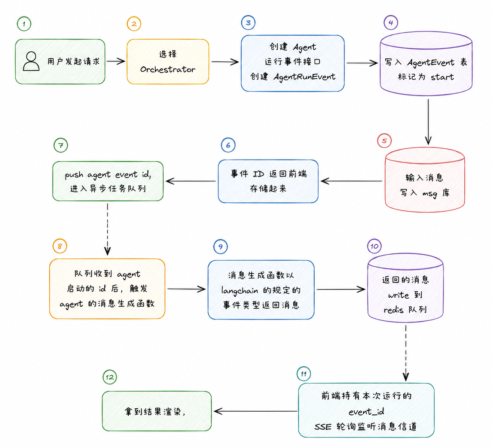

多 Agent 系统里有一个比较常见的问题：**Agent，尤其是类似 ChatGPT, Gemini, 这类 web 端的 Chatbot在执行期间，会出现这样一个问题，即刷新了，关闭了，但是你重新加载时，还是会发现已经完成了**

结合本人在工作中运行的方案实现了一种简单的队列持久化+agent运行分离和类似codex、claude的steer机制。

---

## 问题由来

很久之前做业务的时候，虽然是比较简单的业务，想起来一件事，chatbot是怎么实现关了，新开了，叉了网页还继续的，当时第一反应想到的是消息队列, 后来查了下确实是，但是面向独立的场景下，情况又有些特殊
在服务端传统java的kafka和rbmq太重了有点，其次当前的Agent业务不是单独服务层，强行合并非常麻烦。因此做的时候选择了ARQ+Redis的异步任务队列结构去做了处理.
---

## 思路

把任务按类型拆进独立队列，每个队列绑定一个固定 Agent：



```text
用户发起请求-> 选择orchestrator -> 创建Agent运行事件接口创建AgentRunEvent -> 把事件写入AgentEvent表,标记为start，输入的消息进行入msg库 -> 事件ID返回前端存储起来，-> push agent event id,进入异步任务队列 -> 队列收到agent启动的id后，触发agent的消息生成函数 -> 消息生成函数以langchain的规定的事件类型返回消息-> 返回的消息write到redis队列 -> 前端持有本次运行的event_idSSE轮询监听消息信道->拿到结果渲染。
```


