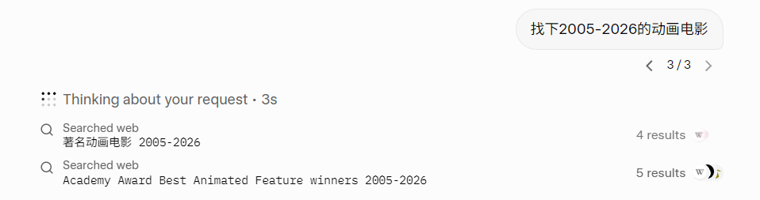
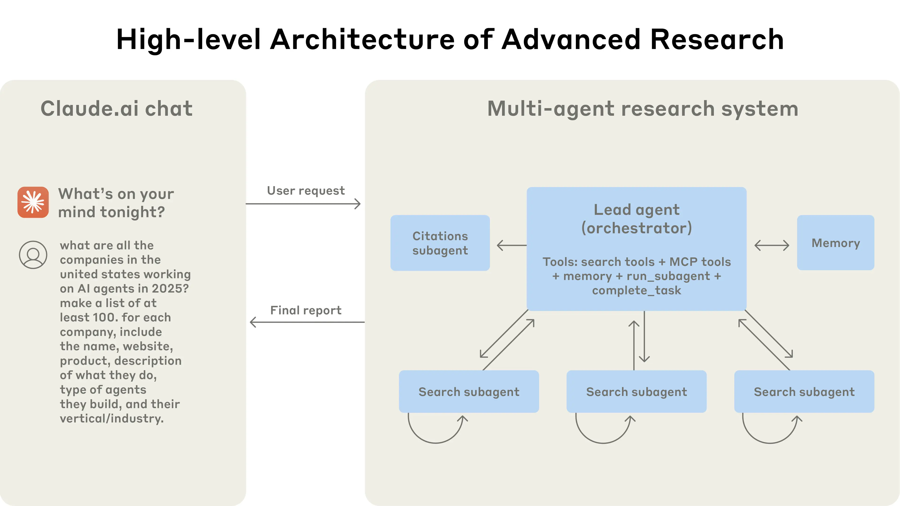
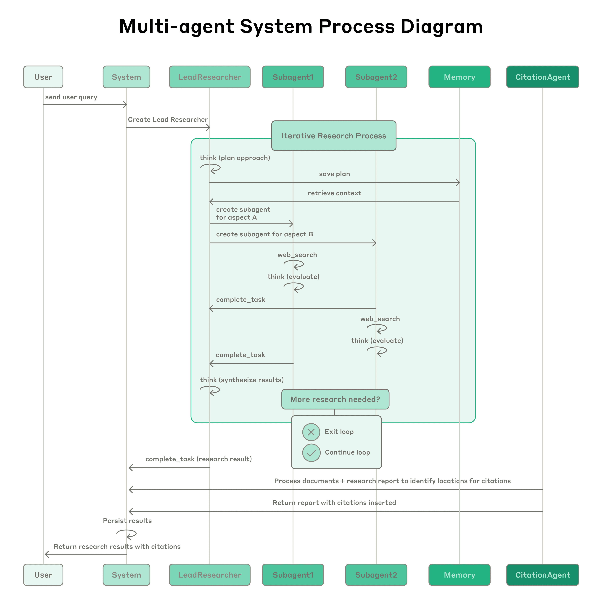

Anthropic 在 2024 年底发布了一篇关于其 Multi-Agent Research System 的技术博客，详细介绍了他们在构建多智能体检索系统时的设计考量与实践经验。本文是对该文章的阅读笔记，梳理了其中的核心设计原则、架构模式以及在工程实践中的思考与验证。

这部分设计的设计方案来自 Anthropic，原本的题目是
[《How to Build Our Multi-Agent Research  System》](http://anthropic.com/engineering/multi-agent-research-system)

该研究主要说明了他们在执行多路检索过程中发现的一些问题。他们的 Research 架构（Research Architecture）和解决方案主要包括两个方面：

1. 根据用户的问题规划检索过程
2. 并行运行检索工具并进行检索

核心就在于这两个方面。

同样值得一提的是，你可以看到 xAI 的 Grok。Grok 作为一个在检索方面能力相对优秀的 AI，在检索过程中也有类似的行为。

因此我重新回顾了这篇文章，整理了其中的核心观点和实践经验。

---

## 搜索行为与多路搜索

首先需要理解 search 行为的一个特点。

一般来说，在日常的 search 行为过程中可以发现一个比较显著的问题：我们在搜索的过程中会反复尝试修改我们的 query。因为用户在使用 search 时，有可能用过一次之后也不是很清楚自己到底想要搜索什么。

这种情况下，多路 search 其实是比较适合的。因为用户本身不太清楚自己的需求，通过多路处理对用户问题进行理解、重写以及延伸，本身也非常适合 agentic search。

这就是多路搜索的核心价值所在。

---

## 性能验证

经过他们内部的验证（一个经典的例子，就是搜索标普 500 所有科技公司的董事会成员），许多以 Claude Opus 4 系列作为主智能体（lead agent）、Claude Haiku 作为子智能体（sub-agents）的多智能体系统，在其内部研究评估（internal research eval）中的表现比单智能体 Claude Opus 4 高出 90.2%。

---

## Orchestrator 模式

在一个可能涉及到多种检索行为的任务中，可以清晰地看到它的 Multi-agent Research System 采用了一种类似 supervisor sub-agent 的模式。但它更像是一个 Orchestrator 模式，即：

1. 多路并行进行查询
2. 总体负责任务的开始和执行
3. 多路执行员（agents）结果召回

他们在 25 年的时候也提到了 Agentic RAG 这个方式。

因为之前的 RAG 更像是一种静态的方式，而不是说我什么时候需要 RAG 的时候，我才是 RAG。

---

## 工作流程详解

> Process diagram showing the complete workflow of our multi-agent Research system. When a user submits a query, the system creates a LeadResearcher agent that enters an iterative research process. The LeadResearcher begins by thinking through the approach and saving its plan to Memory to persist the context, since if the context window exceeds 200,000 tokens it will be truncated and it is important to retain the plan. It then creates specialized Subagents (two are shown here, but it can be any number) with specific research tasks. Each Subagent independently performs web searches, evaluates tool results using interleaved thinking, and returns findings to the LeadResearcher. The LeadResearcher synthesizes these results and decides whether more research is needed—if so, it can create additional subagents or refine its strategy. Once sufficient information is gathered, the system exits the research loop and passes all findings to a CitationAgent, which processes the documents and research report to identify specific locations for citations. This ensures all claims are properly attributed to their sources. The final research results, complete with citations, are then returned to the user.

这个架构的核心思路是，它类似于一个 Leader、Supervisor 和 Sub-agent 的分层协作计划。

1. 角色分工与持久化：
   Leader 负责思考并制定计划。它会将计划持久化到 memory 中，目的是防止上下文（context）爆掉以后导致截断，或者让系统忘记掉原有的计划。

2. 搜索与重写机制：
   它会根据你的问题进行类似于 rewrite 的行为。如果你用过 Grok 或者类似的 AI Research 工具，你会发现它会重写你的问题，以便全面理解其中的多个维度，并针对这些维度去进行搜索。Grok 更多的是纯 Web 的检索，但是 Codex 的检索可能会涉及到我们的一些历史方案、其他项目以及现存代码的 research，所以有时候会稍微有一些不一样。

3. 循环与退出逻辑：

   (a) 检索结果会返回给 Leader，由 Leader 进行 rethinking。

   (b) 如果 Leader 发现已经收集到了足够的信息，系统就会退出循环，进入 CitationAgent 的验证阶段，去处理文件并确认来源。

   (c) 如果信息不足，系统则会继续绕回循环中执行。

---

## 挑战与局限性

当然，这篇文章里也列举了一些缺点。因为 Multi-Agent System 的复杂度，尤其是在协同方面的复杂度，是呈指数级增长的。
但是他们在研究的过程中，估计也会发现这样一个问题。因为我自己在实践的时候也发现过，如果不加限制，搜索就会无止境地进行下去。

本质上是因为你没有限定好什么叫"已经完善的结果"，没有规定好：

1. 什么样的问题需要多个 agent 去检索；
2. 什么时候该 stop。

---

## 关键设计原则

### 1. Think Like Your Agents

> Think like your agents. To iterate on prompts, you must understand their effects. To help us do this, we built simulations using our Console with the exact prompts and tools from our system, then watched agents work step-by-step. This immediately revealed failure modes: agents continuing when they already had sufficient results, using overly verbose search queries, or selecting incorrect tools. Effective prompting relies on developing an accurate mental model of the agent, which can make the most impactful changes obvious.

同时，对于 sub-agent 来说，无论你朝着什么方向去做，本质上还是 Prompt Engineering（提示工程）。

归根到底，你要明白什么样的东西是一个好的 prompt。比如：

1. 是否有清晰的边界；
2. 明确的要求；
3. 规定能做什么和不能做什么；
4. 明确最终达成的目标大概是什么样子。

### 2. Teach the Orchestrator How to Delegate

> Teach the orchestrator how to delegate. In our system, the lead agent decomposes queries into subtasks and describes them to subagents. Each subagent needs an objective, an output format, guidance on the tools and sources to use, and clear task boundaries. Without detailed task descriptions, agents duplicate work, leave gaps, or fail to find necessary information. We started by allowing the lead agent to give simple, short instructions like 'research the semiconductor shortage,' but found these instructions often were vague enough that subagents misinterpreted the task or performed the exact same searches as other agents. For instance, one subagent explored the 2021 automotive chip crisis while 2 others duplicated work investigating current 2025 supply chains, without an effective division of labor.

然后他第二段这个时候，本身其实也是对的。这本质上还是提示词工程，因为你教会 Orchestrator 如何去分配任务，反过来也要求 leader 把任务分解清楚。

虽然原文的这一段我之前没有读过，但设计思路是一致的。原文是这样写的：

> "Each sub-agent needs an objective and output format, guidance on the tools and sources to use, and clear task boundaries. Without a detailed task description, it leads to duplication of work or gaps for necessary information."

本质上，你还是需要把提示词上面的边界、要求、能够使用的工具，以及能做和不能做的部分都写清楚。

### 3. Scale Effort to Query Complexity

> Scale effort to query complexity. Agents struggle to judge appropriate effort for different tasks, so we embedded scaling rules in the prompts. Simple fact-finding requires just 1 agent with 3-10 tool calls, direct comparisons might need 2-4 subagents with 10-15 calls each, and complex research might use more than 10 subagents with clearly divided responsibilities. These explicit guidelines help the lead agent allocate resources efficiently and prevent overinvestment in simple queries, which was a common failure mode in our early versions.

第三点总结下来，就是要根据问题的复杂度来合理规划任务的规模。

### 4. Tool Design and Selection

> Tool design and selection are critical. Agent-tool interfaces are as critical as human-computer interfaces. Using the right tool is efficient—often, it's strictly necessary. For instance, an agent searching the web for context that only exists in Slack is doomed from the start. With MCP servers that give the model access to external tools, this problem compounds, as agents encounter unseen tools with descriptions of wildly varying quality. We gave our agents explicit heuristics: for example, examine all available tools first, match tool usage to user intent, search the web for broad external exploration, or prefer specialized tools over generic ones. Bad tool descriptions can send agents down completely wrong paths, so each tool needs a distinct purpose and a clear description.

第四点我觉得他写的特别好。他们在做搜索的时候，会优先考虑信息检索的难度。

比如像 Slack 这种协作式的工具，它本身的信息是存在于封闭内部的，也就是说你纯靠 search 是搜不到这些东西的。所以你在将 tool 给 agent 使用的时候，就需要去设立这样一个边界。

他是这样说的："Give our agent explicit heuristics."

例如：

1. 先去看所有可用的工具，然后根据用户的意图选择最合适的工具。
2. 广度优先（广泛搜索）：

   (a) 在网上搜的话，先用 Web 搜索。

   (b) 针对性的意图和工具，就用针对性的意图去搜索。

而且首选应该是那种更广泛、更广度搜索的工具，而非使用过于 specific 的工具。

### 5. Let Agents Improve Themselves

> Let agents improve themselves. We found that the Claude 4 models can be excellent prompt engineers. When given a prompt and a failure mode, they are able to diagnose why the agent is failing and suggest improvements. We even created a tool-testing agent—when given a flawed MCP tool, it attempts to use the tool and then rewrites the tool description to avoid failures. By testing the tool dozens of times, this agent found key nuances and bugs. This process for improving tool ergonomics resulted in a 40% decrease in task completion time for future agents using the new description, because they were able to avoid most mistakes.

他这边提了一个 self-improvement 的概念。当然，到目前为止（比如说到现在的 2026 年 5 月），这个概念其实已经应用得特别广泛了，但我不知道这个概念第一次提出是在哪里。

我觉得这一点其实是他在给 agent 预留自我进化的空间：

1. 他会给模型一定的自我进化提示，引导其在执行过程中不断优化
2. 但我觉得这套机制严重依赖模型本身的能力。从 25 年下半年至今，模型能力持续进化，Self-Improvement 的设计思路也因此变得越来越实用，值得深入探索。

### 6. Start Wide, Then Narrow Down

> Start wide, then narrow down. Search strategy should mirror expert human research: explore the landscape before drilling into specifics. Agents often default to overly long, specific queries that return few results. We counteracted this tendency by prompting agents to start with short, broad queries, evaluate what's available, then progressively narrow focus.

这样的过程就是 Start wide then narrow down。简单来说就是广撒网，然后捞大鱼，或者说捞那些比较重要的鱼。

### 7. Parallel Tool Calling

> Parallel tool calling transforms speed and performance. Complex research tasks naturally involve exploring many sources. Our early agents executed sequential searches, which was painfully slow. For speed, we introduced two kinds of parallelization: (1) the lead agent spins up 3-5 subagents in parallel rather than serially; (2) the subagents use 3+ tools in parallel. These changes cut research time by up to 90% for complex queries, allowing Research to do more work in minutes instead of hours while covering more information than other systems.

最后一个就是并行工具的运行，也就是并行的检索。

据他说，这能够 cut down 90% 的时间。这种并行可以理解为 MapReduce 的逻辑，通过同时发起好几个请求来提高效率。这其实既是一个工程上的问题，也是一个比较有工程巧思的设计。

---

## 总结

> At the end, our priorities should focus on instilling good heuristics . It's about providing progressive, positive inspiration rather than just rigid rules.

我个人不太倾向于制定过于严格的禁止性规则，而是更看重正向引导。

---

之前我突然想起这篇文章，又回来写了一下。因为之前这篇文章提过任务切分，我想聊聊我在工程中出现的一个问题。

1. 边界定义问题

   之前我做 Multi Search Agent 的时候，定边界没定义好，有些任务写得比较模糊，导致出现了一个很严重的问题：对于一个简单问题的调用，竟然触发了好几个 Web Search。这其实怪我自己，应该提前想到这个情况。

2. 多任务并发与代码风格

   我之前对于统一问题的多方面并发，想了好几种实现方案，目的是为了让代码风格更符合 LangChain 本身的风格：

   (a) 节点插入方案

       当时想用 Node 或者类似的方法加到 Graph 里面。但由于 `compiled_graph` 返回的是 Compiled Graph，这意味着你没有办法再往里边插图了。

   (b) Middleware 协程方案

       通过 Middleware，在树状上下游里设置多个 Tools，然后用协程的方式去驱动多个 Observation。但这种方式我觉得有点笨重。

   (c) LangGraph Workflow 方案

       这是最后采用的一种方式，即通过 LangGraph 的 Workflow 加 MapReduce 的模式，将获取到的上下文和搜索结果进行整合。

可以预见的是，他们在文章里也说了这件事：做 multi-agent research 的时候，sub-agent 是用来干活的，将干完的活传给 leader agent，由 leader agent 再去判断是否需要继续调用多个 search 或者进行其他操作。

在 LangChain 的官方文档里也提过这一茬，就是 sub-agent 应该是无状态的，但它还是需要一些模型的功能。

后来我设计的时候，因为 Claude 的模型是一脉相承的通用架构（General Purpose），它继承了父模型的模型设计。对于我来说，我当时做了一个简化的设计决策，直接把它设成了 Flash 模型，让它只管执行，把内容总结好反馈给 leader 就行了。

